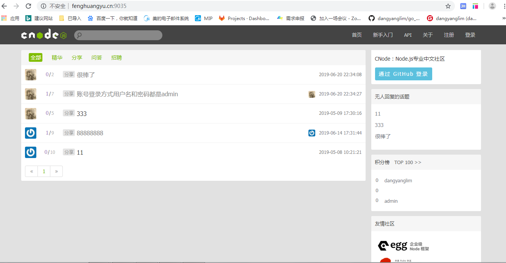

# go_cnode

#### 项目介绍
http://cnodejs.org/ 是一个用nodejs语言编写的开源论坛  
打算是用golang语言重写  
项目部署在 http://fenghuangyu.cn:9035 账号密码admin   
#### 安装
go version 1.12.4  
git version 2.19  
go版本>1.11  
git版本>2.17  
用了go mod 管理依赖 
安装mongodb  
安装redis  

## 目录结构  
```
│  .gitignore
│  build.bat
│  conf.json
│  go.mod
│  go.png
│  go.sum
│  main.go
│  README.md
│  router.go
│
├─.vscode
│      launch.json
│      settings.json
│
├─controllers
│  ├─reply
│  │      reply.go
│  │
│  ├─sign
│  │      sign.go
│  │
│  ├─site
│  │      site.go
│  │
│  └─topic
│          topic.go
│
├─database
│      mysql.go
│
├─mgoModels
│      reply.go
│      topic.go
│      user.go
│
├─public
│  │  github-card.html
│  │
│  ├─images
│  │      cngo.svg
│  │      cngo2.svg
│  │      cngo3.svg
│  │      cngo_icon_32.png
│  │      cnodejs.svg
│  │      cnodejs_light.svg
│  │      cnode_icon_32.png
│  │      cnode_icon_32.svg
│  │      cnode_icon_64.png
│  │      cnode_logo_128.png
│  │      cnode_logo_32.png
│  │      digitalocean.png
│  │      egg-logo.png
│  │      golangtc-logo.png
│  │      iojs-logo-w150h50.png
│  │      iojs-logo.png
│  │      logo.png
│  │      logo_bak.png
│  │      nodejs_black.png
│  │      phphub-logo.png
│  │      qiniu.png
│  │      ruby-china-20150529.png
│  │      ruby-china-logo2.png
│  │      search.png
│  │      ucloud.png
│  │      upyun_logo.png
│  │
│  ├─img
│  │      glyphicons-halflings-white.png
│  │      glyphicons-halflings.png
│  │
│  ├─javascripts
│  │      main.js
│  │      responsive.js
│  │
│  ├─libs
│  │  │  jquery-2.1.0.js
│  │  │  jquery-ujs.js
│  │  │  jquery.atwho.js
│  │  │  jquery.caret.js
│  │  │  lodash.compat.js
│  │  │  markdownit.js
│  │  │  qrcode.js
│  │  │
│  │  ├─bootstrap
│  │  │  ├─css
│  │  │  │      bootstrap-responsive.css
│  │  │  │      bootstrap-responsive.min.css
│  │  │  │      bootstrap.css
│  │  │  │      bootstrap.min.css
│  │  │  │
│  │  │  ├─img
│  │  │  │      glyphicons-halflings-white.png
│  │  │  │      glyphicons-halflings.png
│  │  │  │
│  │  │  └─js
│  │  │          bootstrap.js
│  │  │          bootstrap.min.js
│  │  │
│  │  ├─code-prettify
│  │  │      lang-apollo.js
│  │  │      lang-clj.js
│  │  │      lang-css.js
│  │  │      lang-go.js
│  │  │      lang-hs.js
│  │  │      lang-lisp.js
│  │  │      lang-lua.js
│  │  │      lang-ml.js
│  │  │      lang-n.js
│  │  │      lang-proto.js
│  │  │      lang-scala.js
│  │  │      lang-sql.js
│  │  │      lang-tex.js
│  │  │      lang-vb.js
│  │  │      lang-vhdl.js
│  │  │      lang-wiki.js
│  │  │      lang-xq.js
│  │  │      lang-yaml.js
│  │  │      prettify.css
│  │  │      prettify.js
│  │  │
│  │  ├─editor
│  │  │  │  editor.css
│  │  │  │  editor.js
│  │  │  │  ext.js
│  │  │  │
│  │  │  └─fonts
│  │  │          icomoon.dev.svg
│  │  │          icomoon.eot
│  │  │          icomoon.svg
│  │  │          icomoon.ttf
│  │  │          icomoon.woff
│  │  │
│  │  ├─font-awesome
│  │  │  ├─css
│  │  │  │      font-awesome.css
│  │  │  │
│  │  │  └─fonts
│  │  │          fontawesome-webfont.eot
│  │  │          fontawesome-webfont.svg
│  │  │          fontawesome-webfont.ttf
│  │  │          fontawesome-webfont.woff
│  │  │          FontAwesome.otf
│  │  │
│  │  └─webuploader
│  │          webuploader.css
│  │          webuploader.withoutimage.js
│  │
│  ├─stylesheets
│  │      common.css
│  │      jquery.atwho.css
│  │      responsive.css
│  │      style.less
│  │
│  └─upload
│          .gitkeep
│
├─service
│  ├─cache
│  │      .DS_Store
│  │      cache.go
│  │
│  └─mail
│          .DS_Store
│          mail.go
│
├─utils
│      dysms.go
│
└─views
    ├─about
    │      about.html
    │
    ├─api
    │      api.html
    │
    ├─common
    │      card.html
    │      footer.html
    │      header.html
    │      sidebar.html
    │      sidebar2.html
    │      _sponsors.html
    │
    ├─edit
    │      edit.html
    │
    ├─getStart
    │      getstart.html
    │
    ├─index
    │      abstract.html
    │      index.html
    │      main.html
    │      topic_list.html
    │
    ├─message
    │      message_index.html
    │
    ├─notify
    │      notify.html
    │
    ├─searchPass
    │      search_pass.html
    │
    ├─setting
    │      setting.html
    │
    ├─showSignUp
    │      showsignup.html
    │
    ├─signIn
    │      signin.html
    │
    ├─signUp
    │      signup.html
    │
    └─topic
            reply.html
            topicIndex.html
```
 
  
 
## 使用
 
### 使用命令行

```bash
$ git clone https://github.com/dangyanglim/go_cnode.git
$ cd go_cnode
$ redis-server                     # 要安装redis
$ go run main.go router.go         # 访问 http://localhost:9035
```
#### 功能介绍
- Github登录  
- Go 模块管理  
- 后台 Gin+mongodb+redis
- 前台 bootstrap+jquery+渲染模板  

  
